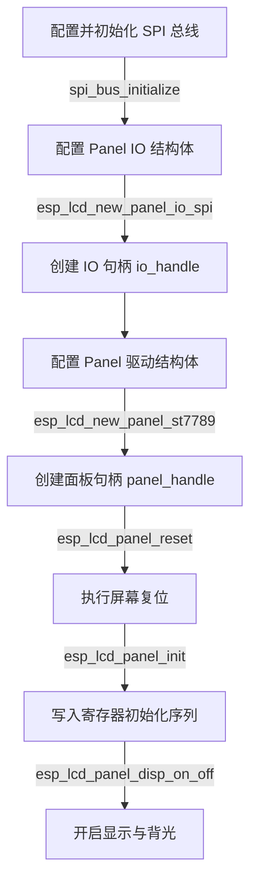

# ESP-IDF esp_lcd 框架标准配置与立创实战派 S3 硬件适配反思

本指南旨在帮助开发者全面理解 ESP-IDF 官方推荐的 `esp_lcd` 液晶驱动框架，对比常规 ST7789 屏幕配置流程，深入剖析“立创实战派 S3”开发板的硬件特殊性，并揭示近期进行的几项底层技术优化的设计原理与实现方式。

---

## 1. 常规 ESP-IDF 下的 esp_lcd 标准配置流程

在 ESP-IDF v5.0 及以上版本中，液晶屏驱动被统一抽象为 `esp_lcd` 组件，主要分为两层：**IO 接口层 (Panel IO)** 和 **面板控制层 (Panel)**。标准的 SPI 接口 LCD 初始化流程如下：



### 1.1 SPI 总线初始化
常规方案配置 SPI 主机（如 `SPI2_HOST`），分配 SCK、MOSI、MISO（单向屏设为 -1）以及传输限额：
```c
spi_bus_config_t buscfg = {
    .sclk_io_num = PIN_NUM_CLK,
    .mosi_io_num = PIN_NUM_MOSI,
    .miso_io_num = -1,
    .quadwp_io_num = -1,
    .quadhd_io_num = -1,
    .max_transfer_sz = MAX_TRANSFER_BYTES,
};
spi_bus_initialize(SPI2_HOST, &buscfg, SPI_DMA_CH_AUTO);
```

### 1.2 创建 Panel IO 句柄
配置 DC（数据/命令）引脚、CS（片选）引脚、像素时钟频率及 SPI 工作模式。在常规硬件中，**CS 通常直接连接到 ESP32 的原生 GPIO 管脚上**，由 `esp_lcd` 驱动硬件层自动控制：
```c
esp_lcd_panel_io_spi_config_t io_config = {
    .dc_gpio_num = PIN_NUM_DC,
    .cs_gpio_num = PIN_NUM_CS,   // 关联标准 GPIO
    .pclk_hz = 40 * 1000 * 1000, // 典型 40MHz
    .lcd_cmd_bits = 8,
    .lcd_param_bits = 8,
    .spi_mode = 0,               // 典型 Mode 0 或 Mode 3
    .trans_queue_depth = 10,
};
esp_lcd_new_panel_io_spi((esp_lcd_spi_bus_handle_t)SPI2_HOST, &io_config, &io_handle);
```

### 1.3 创建面板驱动句柄并初始化
绑定硬件复位引脚（RST 连至标准 GPIO），创建 ST7789 面板句柄，然后依次执行复位与初始化：
```c
esp_lcd_panel_dev_config_t panel_config = {
    .reset_gpio_num = PIN_NUM_RST, // 原生复位 GPIO
    .rgb_ele_order = LCD_RGB_ELEMENT_ORDER_RGB,
    .bits_per_pixel = 16,
};
esp_lcd_new_panel_st7789(io_handle, &panel_config, &panel_handle);
esp_lcd_panel_reset(panel_handle); // 硬件拉低 RST 复位
esp_lcd_panel_init(panel_handle);  // 写入厂商默认初始化序列
```

---

## 2. “立创实战派 S3”开发板的硬件特殊性

立创实战派 S3 在硬件设计上面临着外设极多、GPIO 管脚极其紧张的限制（主控需要兼顾 8MB 八线 PSRAM、DVP 摄像头、I2S 双麦克风与音频编解码器、SD 卡等）。因此，LCD 接口的设计具有以下三大特殊之处：

### 2.1 外部 I2C 扩展芯片控制片选 (LCD_CS)
* **硬件设计**：屏幕的 `LCD_CS` 引脚没有连至 ESP32-S3 的原生 GPIO，而是接在了 I2C IO 扩展芯片 `PCA9557` 的 `IO0` 管脚上。
* **软件层面的影响**：
  * 我们必须在 `esp_lcd_panel_io_spi_config_t` 中将 `.cs_gpio_num` 设为 `-1`（即 `GPIO_NUM_NC`），明示 `esp_lcd` 的底层硬件驱动无需（也无法）自行控制片选线。
  * 在初始化屏幕驱动之前，软件必须先通过 I2C 总线初始化 PCA9557 芯片，并手动操作其输出电平来控制 `LCD_CS` 的拉低与拉高。

### 2.2 硬件复位管脚 (LCD_RST) 连至 CHIP_PU
* **硬件设计**：屏幕的 `RST` 复位线没有连至任何 GPIO，而是与主芯片的 `CHIP_PU`（系统复位按键）直接并联。这意味着当开发板上电时，屏幕会自动跟随系统硬件复位；但软件运行期，CPU 无法通过物理电平拉低对屏幕执行独立硬件复位。
* **软件层面的影响**：
  * 在 `esp_lcd_panel_dev_config_t` 中，必须将 `.reset_gpio_num` 设为 `-1`。
  * `esp_lcd_panel_reset(panel_handle)` 被调用时，由于没有 RST 引脚，驱动会自动回落到通过 SPI 总线发送软件复位指令（`0x01`，即 `ST7789_CMD_SWRESET`）的模式。

### 2.3 通过 GPIO 矩阵 (GPIO Matrix) 路由的高频通信
* **硬件设计**：液晶屏的 SPI 引脚走的是 GPIO Matrix（SCK: IO41, MOSI: IO40, DC: IO39），而非 ESP32-S3 专属的 IO_MUX 直连物理引脚。
* **软件层面的影响**：
  * **时序与采样偏移**：GPIO Matrix 引入的内部栅极延迟在 80MHz 高频下极其显著。为了在这种高频时钟下精确对齐数据，官方例程将 SPI 模式配置为了 **Mode 2** (CPOL=1, CPHA=0，即空闲高电平，下降沿采样)。这在常规理解的 ST7789（Mode 0/3）中并不多见，属于针对 GPIO Matrix 传输滞后进行相位校正的工程实践。

---

## 3. 液晶初始化异常定位与修复对照表

在对比官方参考代码并结合硬件行为分析后，我们整理出以下四个导致“背光正常但无画面刷新”的关键配置差异与修复对照表：

| 异常点 | 先前配置 (黑屏/异常) | 参考/修复配置 (正常刷新) | 原因与底层影响分析 |
| :--- | :--- | :--- | :--- |
| **SPI 传输模式** | SPI Mode 0 (`.spi_mode = 0`) | SPI Mode 2 (`.spi_mode = 2`) | 时钟极性（CPOL=1, CPHA=0）。ST7789 在高频下通过 GPIO 矩阵采样时，需要 Mode 2 以保证数据边缘的抗噪时序稳定性。 |
| **CS 信号使能时序** | SPI 初始化前即拉低 `LCD_CS` | 复位（软件 `reset`）后再拉低 `LCD_CS` | 屏蔽电气毛刺。若提前使能片选，SPI 引脚切换瞬间产生的高频电气毛刺会被屏幕误识别为时钟信号，导致移位寄存器失步，进而使后续初始化寄存器命令序列全部失效。 |
| **显示轴镜像参数** | `mirror(s_panel_handle, false, true)` | `mirror(s_panel_handle, true, false)` | 对齐屏幕物理排线走线方向。原先的轴镜像方向错误，导致图像显示超出寻址范围。 |
| **DMA 缓存分配方式** | 普通 `malloc` 动态申请临时缓冲区 | `heap_caps_malloc` 分配至 `MALLOC_CAP_DMA \| MALLOC_CAP_INTERNAL` | 规避 DMA 寻址限制。当开启 8MB 外置 PSRAM 时，常规 `malloc` 会将缓存分配到 PSRAM 内部。由于 LCD 传输需要高带宽 DMA 通道支持，必须强制约束在片内 SRAM 区域，否则会导致 SPI DMA 传输静默失败。 |

---

## 4. 核心优化技术原理

在初期调通屏幕后，我们针对性能、抗噪和系统稳定性实施了三项深度优化：

### 4.1 复位与片选的时序对齐（毛刺规避原理）
* **错误模式**：如果在初始化 SPI 总线之前，就直接通过 PCA9557 将 `LCD_CS` 永久拉低。
* **问题原理**：SPI 总线在配置引脚（IOMUX/GPIO Matrix）和切换方向的瞬间，时钟线（CLK）和数据线（MOSI）上会产生轻微的**高频电气毛刺**。如果此时 `CS` 已经被拉低，ST7789 的 SPI 移位寄存器会误接收这些毛刺作为有效时钟，导致其内部的**位计数器（Bit Counter）发生错乱（失步）**。紧接着发送的第一个软件复位命令（`0x01`）就会因为移位而变成垃圾命令，使液晶屏彻底初始化失败，表现为开机黑屏。
* **优化策略**：
  1. 初始保持 `LCD_CS` 为高电平（不使能）。
  2. 初始化 SPI 总线并执行 `esp_lcd_panel_reset()`。此时发送软件复位命令，虽然 `CS` 为高屏幕不响应，但该步骤用于初始化驱动内部状态，并将 SPI 引脚毛刺完全屏蔽在外。
  3. 在复位结束、总线电平稳定后，再通过 PCA9557 将 `LCD_CS` 拉低锁定。
  4. 随后执行真正的 `esp_lcd_panel_init()`。此时 ST7789 的 SPI 接收窗口状态完全干净，命令 100% 对齐。

### 4.2 硬件级大小端自动重组（零 CPU 字节交换）
* **常规做法**：ESP32-S3 是小端序（Little-Endian），而标准的 SPI 显示数据协议是大端序（Big-Endian，即高 8 位先发，低 8 位后发）。普通的屏幕清屏或图像填充不得不通过软件遍历缓冲区进行字节调换：
  ```c
  uint16_t swapped = (color >> 8) | (color << 8); // 占用 CPU 算力
  ```
* **优化原理**：
  ST7789 拥有一个内部寄存器 `RAMCTRL (0xB0)`，其第 3 位（`D3`）是 `ENDIAN` 控制位。
  * 当配置 `panel_config.data_endian = LCD_RGB_DATA_ENDIAN_LITTLE` 时，ESP-IDF 底层驱动会自动在初始化阶段向 `RAMCTRL` 写入该位，**通知屏幕硬件控制器在接收到 SPI 字节流后自行进行大小端倒序**。
* **效果**：软件层可以直接写 `s_clear_buffer[i] = color`，完全免去了 CPU 软件字节序转换的指令消耗，渲染效率最大化。

### 4.3 静态 DMA 缓冲区设计（规避堆碎片化）
* **错误模式**：每次清屏或局部刷新时，都在函数内部临时调用 `heap_caps_malloc` 分配一块 DMA SRAM 空间，使用完毕后再 `free`。
* **问题原理**：ESP32-S3 的片内 DMA SRAM 资源是有限的。长期运行的系统如果存在高频的动态内存申请与释放，会导致堆中产生大量的**微小物理空洞（堆碎片）**。当堆碎片累积到一定程度后，即使空闲内存总和足够，也会因为找不到连续的 DMA 内存块而导致分配失败，直接造成屏幕死机或系统崩溃（Out of Memory）。
* **优化策略**：
  在系统初始化阶段（`bsp_lcd_init`），一次性静态分配好固定大小（如 20 行像素，12.8KB）的 DMA SRAM 缓冲区 `s_clear_buffer`。此缓冲区在系统的整个生命周期中保持常驻，彻底规避了动态分配带来的内存碎裂化风险。
