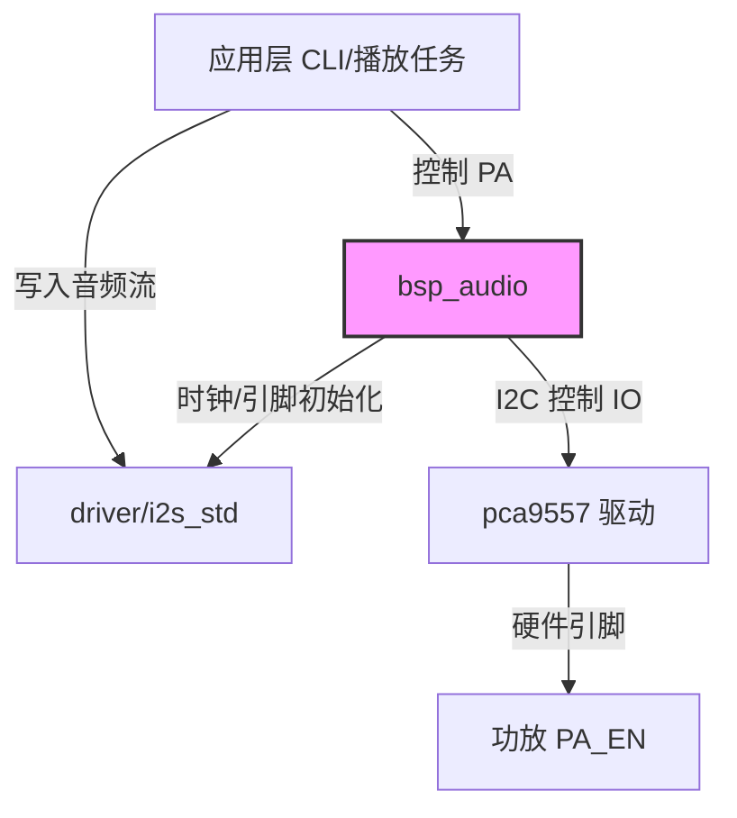

# I2S 音频总线与功放使能进阶设计方案

本文档针对板载音频播放系统，详细设计 I2S0 标准通道的时钟引脚映射与音频功放使能（PA_EN）的控制策略，并为后续 M17（ES8311 Codec）与 M18（ES7210 ADC）的音频流采集播放提供统一的底层支持与接口设计。

---

## 1. 硬件引脚映射与总线架构

在立创实战派 S3 开发板中，音频系统通过主控 ESP32-S3 的 I2S0 接口与板载 Codec 芯片、ADC 芯片连接。本阶段主要完成 I2S 物理总线的接口配置，以及功放使能管脚的控制。

### 1.1 I2S0 物理引脚分配
* **MCK (主时钟)**: `IO38`（输出 256*Fs 或 384*Fs 的高频主时钟，用于 Codec 同步）
* **BCLK (位时钟)**: `IO14`（串行数据时钟）
* **WS (字选择/左右声道时钟)**: `IO13`
* **DO (数据输出/TX)**: `IO45`（用于播放音频数据）
* **DI (数据输入/RX)**: `IO12`（用于采集录音数据）

### 1.2 音频功放控制
板载音频功放（通常为单声道或双声道小功放芯片）由 IO 扩展芯片 `PCA9557` 进行电源与工作状态使能：
* **功放使能引脚 (PA_EN)**: 连接至 `PCA9557` 的 `Pin 1`。
* **控制电平**:
  - `High (1)`: 开启功放，使能扬声器输出。
  - `Low (0)`: 关闭功放，进入关断（Shutdown）状态，以降低待机功耗并防范杂音。

---

## 2. 核心控制策略与防暴音（Pop-Noise）时序

在音频系统上电或切换音轨时，由于电容充放电及总线状态不稳定，极易产生令人不适的“啪嗒”声（Pop-Noise）。

### 2.1 推荐上电/使能时序
为规避 Pop-Noise，驱动初始化和播放时应严格遵循以下时序：
1. **初始化 I2S 硬件**: 配置 I2S 控制器、时钟分配和引脚复用，此时 I2S 总线输出稳定时钟，但功放应保持关闭（`PA_EN = 0`）。
2. **延迟等待**: 等待 50ms ~ 100ms 待外围电容充电和电平建立稳定。
3. **使能功放**: 通过 I2C 总线发送指令将 `PA_EN` 置为 `1`。
4. **开始播放**: 向 I2S DMA 发送静音数据（全0数据帧），然后再播放有效音频数据。

### 2.2 推荐下电/去使能时序
1. **停止数据写入**: 完成音频流播放，发送一段简短的静音帧或淡出（Fade-out）。
2. **关闭功放**: 将 `PA_EN` 置为 `0`。
3. **释放/去初始化 I2S 驱动**: 停用 I2S 时钟和物理总线。

---

## 3. BSP 接口演进与多通道设计

本阶段（M16）为纯总线时钟与引脚配置阶段。为保证向 M17 和 M18 的无缝演进，BSP 层需要提供良好的接口抽象与资源管理。



### 3.1 BSP Audio API 架构设计
```c
/**
 * @brief 初始化板级音频 I2S0 标准通道及配置功放引脚
 */
esp_err_t bsp_audio_i2s_init(void);

/**
 * @brief 功放状态控制接口
 * @param enable true为使能功放，false为关闭功放以防杂音和节能
 */
esp_err_t bsp_audio_pa_enable(bool enable);

/**
 * @brief 动态获取当前配置并注册的 TX 通道句柄，供上层 Codec/音频播放框架直接写入 DMA 数据
 */
i2s_chan_handle_t bsp_audio_get_tx_handle(void);
```

### 3.2 演进计划 (M17 & M18)
* **M17 ES8311 播放**: 在 I2S0 TX 通道初始化完成后，利用 I2C1 接口（地址 `0x18`）配置 ES8311 Codec。通过 `bsp_audio_get_tx_handle()` 获取句柄，结合 `esp_codec_dev` 框架播放提示音。
* **M18 ES7210 录音**: 初始化 I2S0 RX 通道。通过 I2C1 接口（地址 `0x41`）配置 ES7210 模数转换器，激活双路数字麦克风采集流。
