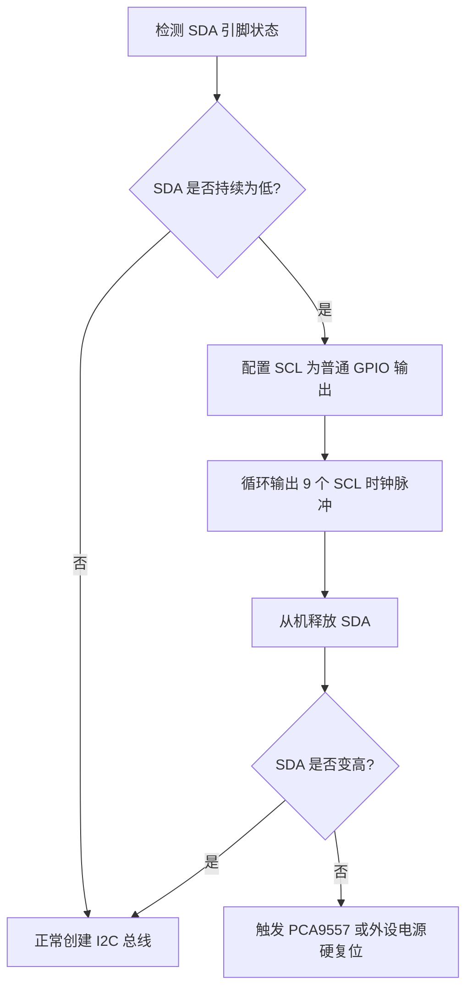

# I2C 总线多实例管理与健壮性恢复进阶方案 (I2C Bus Multi-Instance & Error Recovery)

本方案旨在设计后续里程碑开发中，I2C 驱动模块的重构与升级方案。随着外设不断增加（如 QMI8658A、GT911、ES8311 等），需要为多 I2C 总线实例共享、硬件死锁容灾恢复、电源管理以及线程安全事务管理建立完备的设计规范。

---

## 1. I2C 多总线实例管理设计

虽然板载的核心芯片全部挂载在 I2C1 总线上，但为了支持外部引脚排针（I2C0）扩展以及保证驱动结构的可扩展性，进阶方案将总线句柄管理抽象为总线分配表。

### 1.1 总线枚举与句柄表
```c
typedef enum {
    BSP_I2C_BUS_INTERNAL = 0, // 板载传感器与芯片总线 (I2C1)
    BSP_I2C_BUS_EXTERNAL,     // 外部扩展排针总线 (I2C0)
    BSP_I2C_BUS_MAX
} bsp_i2c_bus_id_t;
```

### 1.2 句柄管理接口定义
```c
/**
 * @brief 根据总线 ID 获取已初始化的主机总线句柄
 * 
 * @param bus_id 总线唯一标识枚举
 * @return i2c_master_bus_handle_t 返回总线句柄，若该总线未初始化则返回 NULL
 */
i2c_master_bus_handle_t bsp_i2c_get_bus_handle(bsp_i2c_bus_id_t bus_id);
```

---

## 2. 线程安全与共享机制 (Thread Safety)

ESP-IDF v5.x 引入了主机/设备句柄拆分机制（`i2c_master_bus_handle_t` 与 `i2c_master_dev_handle_t`）。

### 2.1 独占与共享模式
* **原生互斥保护**：ESP-IDF v5.x 驱动程序内部已经在总线层级集成了互斥锁（Mutex）。当多个任务分别向各自注册的 `i2c_master_dev_handle_t` 发起事务（`i2c_master_transmit` / `i2c_master_receive`）时，驱动会自动串行化处理，确保并发安全。
* **业务级连续传输锁定**：在部分复杂外设读取时（如传感器连续多次写-读且不可被中断），需要在设备配置中利用事务级操作，或在上层外设驱动中手动封装局部的互斥锁。

---

## 3. I2C 总线死锁硬件恢复机制 (I2C Bus Lockup Recovery)

I2C 通信中，如果主控在传输过程中发生复位（如 Watchdog 触发或软件重启），而从机恰好处于拉低 SDA 数据线的阶段（等待发送数据 0 ），此时由于主控复位释放了 SCL 时钟，总线将永久陷入**从机死锁拉低 SDA，主机无法发送起始信号**的状态。

### 3.1 自动恢复策略 (SCL Clock Toggling)
在 `bsp_i2c_init` 初始化时，先对 SDA/SCL 引脚进行状态检测。若发现 SDA 在空闲状态下被持续拉低，将执行以下**手动时钟脉冲释放逻辑**：



#### 实现伪代码：
```c
esp_err_t bsp_i2c_recover_bus(gpio_num_t sda_pin, gpio_num_t scl_pin)
{
    // 1. 设置 SDA 为输入，SCL 为输出
    gpio_config_t io_conf = {
        .pin_bit_mask = (1ULL << sda_pin),
        .mode = GPIO_MODE_INPUT,
        .pull_up_en = GPIO_PULLUP_ENABLE,
    };
    gpio_config(&io_conf);
    
    io_conf.pin_bit_mask = (1ULL << scl_pin);
    io_conf.mode = GPIO_MODE_OUTPUT_OD; // 开漏模式输出
    gpio_config(&io_conf);

    // 2. 检测 SDA 是否被拉低
    if (gpio_get_level(sda_pin) == 0) {
        ESP_LOGW("bsp_i2c", "SDA line is held low. Attempting I2C bus recovery...");
        
        // 发送最多 9 个时钟脉冲，直到从机释放 SDA
        for (int i = 0; i < 9; i++) {
            gpio_set_level(scl_pin, 0);
            rom_delay_us(5);
            gpio_set_level(scl_pin, 1);
            rom_delay_us(5);
            
            if (gpio_get_level(sda_pin) == 1) {
                ESP_LOGI("bsp_i2c", "SDA released after %d clock pulses.", i + 1);
                break;
            }
        }
    }
    return ESP_OK;
}
```

---

## 4. 低功耗与动态电源管理 (PM & Sleep)

后续在引入 **M11 低功耗与电源管理系统** 时，I2C 总线需要配合动态频率缩减 (DFS) 和自动轻度睡眠 (Light Sleep) 进行优化：
1. **电源备份/恢复**：在初始化总线时，通过配置 `allow_pd = 1` 标志，允许系统在 Light Sleep 期间关闭 I2C 控制器的电源域，由驱动自动备份与恢复相关寄存器，以节省额外功耗。
2. **频率自适应**：在 DFS 发生 CPU 主频切换时，I2C 驱动的时钟源使用 `I2C_CLK_SRC_DEFAULT`，硬件会自动基于源时钟（如 XTAL）进行分频自适应，防止总线频率漂移造成通信丢包。

---

## 5. 调试诊断命令升级

在 `app_cli.c` 中，原有的 `i2c_scan` 指令升级为更完备的调试工具集：
* `i2c_scan <bus_id>`：指定扫描哪条物理总线（0: 外部扩展，1: 板载主总线）。
* `i2c_recover <bus_id>`：手动触发某条总线的死锁时钟脉冲恢复逻辑。
* `i2c_test_device <bus_id> <addr>`：连续对指定器件地址进行握手及通讯速率抖动测试，评估信号完整性。
