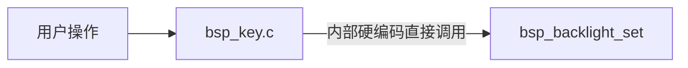
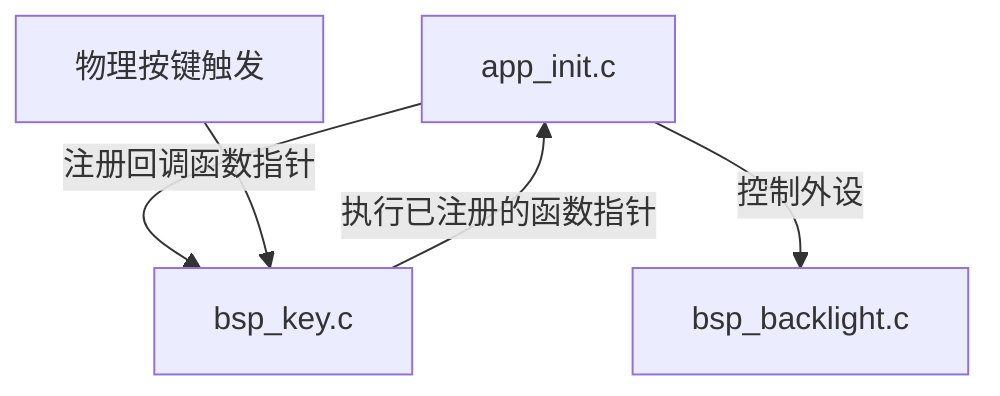
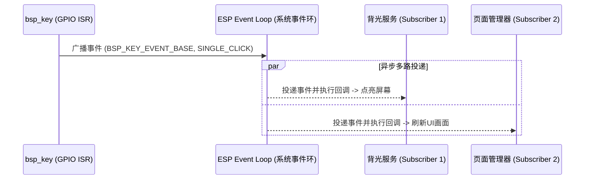

# 板载按键事件驱动与解耦进阶方案 (BSP Key Event Decoupling & Event Loop)

本方案旨在设计后续（Milestone M4 及之后）将板载 BOOT 按键驱动由目前的测试态（直接强耦合调用背光控制）升级为正式的**低耦合事件驱动方案**。通过“应用层回调注册”与“系统事件环发布/订阅”两种架构模式，实现输入设备驱动与输出执行机构的物理独立性与高可扩展性。

---

## 1. 强耦合现状与架构缺陷

在 Milestone M3 临时联调测试阶段，为了快速验证按键消抖和中断响应的正确性，代码中采取了如下强耦合逻辑：


### 1.1 架构缺陷
1. **违背单一职责原则**：`bsp_key` 属于输入型 BSP 驱动，不应当感知任何输出设备（如 LCD 背光、LED 指示灯、蜂鸣器）的存在。
2. **零可复用性**：如果将该 `bsp_key` 移植到其他无 LCD 背光的开发板项目，编译器会因找不到 `bsp_backlight.h` 而报错。
3. **无法多路分发**：当系统升级后，若希望按键按下时在控制台打日志的同时播放蜂鸣器并点亮背光，硬编码形式将导致底层驱动代码被频繁修改。

---

## 2. 方案一：事件回调注册接口封装 (Event Callback Registration)

这是最轻量、最适用于独立 BSP 组件的解耦方案。驱动程序通过函数指针向外部（应用层）暴露事件订阅接口。

### 2.1 架构图


### 2.2 代码接口设计

#### 1. 头文件接口变更 (`bsp_key.h`)
```c
// 统一按键事件类型（沿用/封装底层 iot_button 的事件）
typedef void (*bsp_key_cb_t)(void *usr_data);

/**
 * @brief 注册按键事件回调函数
 * @param event 按键事件类型（如 BUTTON_SINGLE_CLICK, BUTTON_DOUBLE_CLICK）
 * @param cb 用户自定义的回调函数指针
 * @param usr_data 用户私有上下文数据
 * @return esp_err_t 注册结果
 */
esp_err_t bsp_key_register_callback(button_event_t event, bsp_key_cb_t cb, void *usr_data);
```

#### 2. 驱动源文件实现 (`bsp_key.c`)
```c
// 彻底移除对 "bsp_backlight.h" 的包含

esp_err_t bsp_key_register_callback(button_event_t event, bsp_key_cb_t cb, void *usr_data)
{
    if (s_btn_handle == NULL) {
        return ESP_ERR_INVALID_STATE;
    }
    // 直接安全转发给底层的 iot_button 组件
    return iot_button_register_cb(s_btn_handle, event, (button_cb_t)cb, usr_data);
}
```

#### 3. 应用层业务绑定 (`app/app_init.c` 或专门的按键控制逻辑)
```c
static void app_backlight_on_handler(void *arg, void *usr_data)
{
    bsp_backlight_set(true); // 调用背光开启
}

static void app_backlight_off_handler(void *arg, void *usr_data)
{
    bsp_backlight_set(false); // 调用背光关闭
}

void app_init(void)
{
    bsp_backlight_init();
    bsp_key_init();
    
    // 绑定物理事件与业务控制
    bsp_key_register_callback(BUTTON_SINGLE_CLICK, app_backlight_on_handler, NULL);
    bsp_key_register_callback(BUTTON_DOUBLE_CLICK, app_backlight_off_handler, NULL);
}
```

---

## 3. 方案二：ESP-IDF 系统事件环广播机制 (ESP Event Loop)

在更复杂的整机固件中，推荐使用 ESP-IDF 官方提倡的 **`esp_event` (系统事件总线)** 机制。该方案可以支持“一对多”的多路分发和跨任务异步处理。

### 3.1 架构设计


### 3.2 核心事件声明与定义 (`bsp_key_event.h`)
```c
#include "esp_event.h"

// 声明按键事件基（EVENT BASE）
ESP_EVENT_DECLARE_BASE(BSP_KEY_EVENT_BASE);

// 定义具体的按键事件 ID
typedef enum {
    BSP_KEY_EVENT_SINGLE_CLICK,
    BSP_KEY_EVENT_DOUBLE_CLICK,
    BSP_KEY_EVENT_LONG_PRESS,
} bsp_key_event_id_t;
```

### 3.3 核心代码实现

#### 1. 按键驱动触发广播 (`bsp_key.c`)
```c
static void button_single_click_cb(void *arg, void *usr_data)
{
    // 往系统默认事件环中发布广播，非阻塞投递
    esp_event_post(BSP_KEY_EVENT_BASE, BSP_KEY_EVENT_SINGLE_CLICK, NULL, 0, portMAX_DELAY);
}
```

#### 2. 多模块订阅执行 (`app_init.c` 或业务层)
```c
// 背光控制订阅器
static void backlight_event_handler(void* handler_args, esp_event_base_t base, int32_t id, void* data)
{
    if (id == BSP_KEY_EVENT_SINGLE_CLICK) {
        bsp_backlight_set(true);
    } else if (id == BSP_KEY_EVENT_DOUBLE_CLICK) {
        bsp_backlight_set(false);
    }
}

void app_init(void)
{
    // ... 硬件初始化 ...
    
    // 向默认系统事件环注册按键事件的监听器
    ESP_ERROR_CHECK(esp_event_handler_instance_register(
        BSP_KEY_EVENT_BASE, 
        ESP_EVENT_ANY_ID, 
        &backlight_event_handler, 
        NULL, 
        NULL
    ));
}
```

---

## 4. 迁移与重构规划 (Migration Plan)

当按键进入正式业务集成阶段（M4 之后）时，开发人员需按照以下步骤开展重构：

* [ ] **步骤一：解耦底层代码**
  * 修改 `bsp/key/bsp_key.c`，删除 `#include "bsp_backlight.h"`。
  * 移除 `button_single_click_cb` 与 `button_double_click_cb` 内部的 `bsp_backlight_set` 调用。
* [ ] **步骤二：提供事件暴露接口**
  * 在 `bsp_key.c` 及头文件中补充 `bsp_key_register_callback`（方案一）或引入事件总线机制（方案二）。
* [ ] **步骤三：应用层重建联动**
  * 在 `app/app_init.c` 或系统控制器中，通过注册回调函数/事件监听器的方式，恢复“单击亮屏，双击灭屏”的调试联动机制，并作为基础交互功能发布。
* [ ] **步骤四：整机编译测试**
  * 运行 `idf.py build` 确保各组件编译相互独立。
