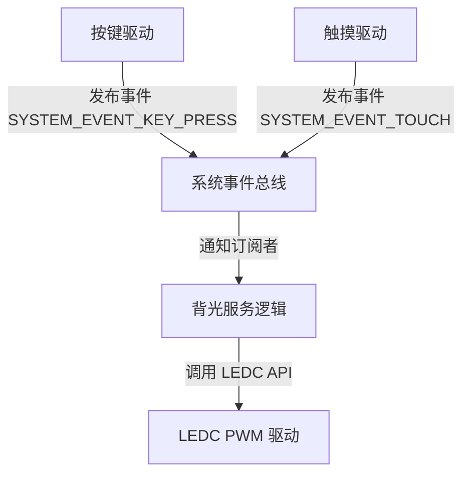

# 屏幕 PWM 调光与渐变平滑过渡方案 (LCD Backlight PWM Dimming)

本方案旨在设计后续（Milestone M12/M14）屏幕集成阶段，将液晶背光由目前的 GPIO 开关控制升级为基于 **LEDC (LED Control)** 外设的 PWM 调光方案。通过硬件 PWM 驱动与系统事件流相结合，实现细粒度亮度调节、呼吸渐变平滑过渡以及自动休眠节能策略。

---

## 1. 硬件外设选型与参数设计

### 1.1 LEDC 外设配置
ESP32-S3 的 LEDC 控制器专为 LED 调光与 PWM 输出设计，支持硬件渐变。
* **时钟源**：`LEDC_AUTO_CLK`（自动选择时钟源，通常为 80MHz APB 时钟，确保 PWM 频率稳定）。
* **通道模式**：`LEDC_LOW_SPEED_MODE`（低速模式，ESP32-S3 仅支持低速模式，由软件触发占空比更新，硬件自动渐变）。
* **GPIO 引脚**：`GPIO42`。
* **分辨率**：`LEDC_TIMER_10_BIT`（10位分辨率，即 `0 ~ 1023` 级亮度，可提供极为平滑的过度曲线）。
* **PWM 频率**：`200Hz`（在 PMOS 供电开关硬件下，200Hz 既能完全规避人眼可见闪烁，又能将 PMOS 的高频开关损耗与电磁辐射控制在安全范围内）。

### 1.2 PMOS 极性反转逻辑（核心要点）
板载背光电路采用 P-MOS 管控制：
* **GPIO 输出低电平 (0)** $\rightarrow$ PMOS 导通 $\rightarrow$ 背光最亮 (100% 亮度)。
* **GPIO 输出高电平 (1)** $\rightarrow$ PMOS 截止 $\rightarrow$ 背光熄灭 (0% 亮度)。

> [!IMPORTANT]
> **占空比极性映射**：
> 在初始化 LEDC 通道时，必须将输出极性设置为反相（`LEDC_DUTY_ACTIVE_HIGH` / `duty_cycle` 计算反转），或者在软件逻辑中进行映射：
> $$\text{实际写入硬件的 Duty} = 1023 - \text{目标亮度级 (0-1023)}$$

---

## 2. 核心功能设计

### 2.1 平滑渐变过渡 (Smooth Fade)
为防止屏幕突亮或突暗对用户视网膜造成冲击，必须使用 LEDC 提供的硬件渐变中断服务：
1. **安装硬件渐变服务**：`ledc_fade_func_install(0)`。
2. **渐变接口调用**：
   使用 `ledc_set_fade_with_time()` 设置目标亮度和渐变时长（例如从 0 渐变到 100% 耗时 300ms）。
3. **启动渐变**：`ledc_fade_start(LEDC_LOW_SPEED_MODE, LEDC_CHANNEL, LEDC_FADE_NO_WAIT)`。

### 2.2 自动降亮与休眠状态机 (Auto-dimming & Sleep)
背光模块将维护一个轻量级的状态机，通过 `esp_timer` 软件定时器进行轮询或触发：

```mermaid
state_matrix
state "正常工作状态 (100% 亮度)" as Active
state "自动变暗状态 (10% 亮度)" as Dimmed
state "屏幕休眠状态 (背光关闭)" as Off

Active --> Dimmed : 15秒无用户操作
Dimmed --> Off : 15秒无用户操作
Off --> Active : 捕获唤醒事件 (物理按键/触屏)
Dimmed --> Active : 捕获唤醒事件 (物理按键/触屏)
```

---

## 3. 架构设计与事件驱动（解耦方案）

为防止背光逻辑与屏幕、按键、触摸等模块强耦合，背光控制器将作为独立的**订阅者（Subscriber）**，通过系统事件总线（`esp_event`）接收通知：



### 3.1 核心事件定义
* `SYSTEM_EVENT_USER_ACTIVITY`：用户活动事件（按键按下、屏幕被触摸等）。
* 当背光服务监听到该事件时，会**立即平滑唤醒屏幕**，并重置自动调暗与休眠的软件定时器。

---

## 4. 调试指令规划

在 `app_cli.c` 中，原有的 `backlight <0|1>` 升级为更高级的调试命令：
* `backlight <0-100>`：通过占空比设置具体亮度百分比，内部转换为 10 位 LEDC 占空比。
* `backlight fade <0-100> <time_ms>`：指定在 `time_ms` 毫秒内，平滑渐变到指定亮度。
